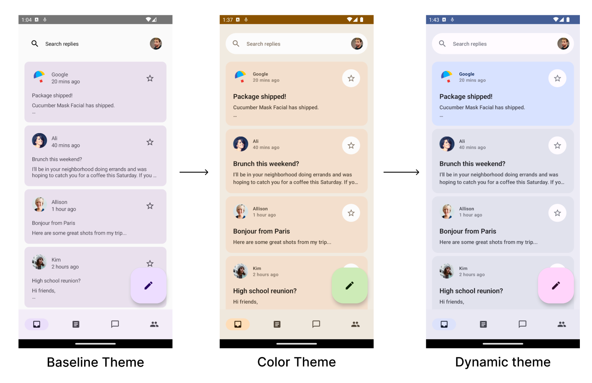

# Theming in Compose with Material 3 Codelab

This folder contains the source code for
the [Theming in Compose with Material 3 Codelab](https://developer.android.com/codelabs/jetpack-compose-theming)

## References

* [Material Design Component](http://material.io/components)
* [Material Theming](http://material.io/design/material-theming)
* [Material Theme Builder](http://m3.material.io/theme-builder#/custom)
* [Color scheme](http://m3.material.io/styles/color/overview)
* [Color scheme and color role](http://m3.material.io/styles/color/the-color-system/key-colors-tones)
* [Dynamic color](http://m3.material.io/styles/color/dynamic-color/overview)
* [Typography](http://m3.material.io/styles/typography/overview)
* [Shapes](http://m3.material.io/styles/shape/overview)
* [Shape documentation](http://m3.material.io/styles/shape/shape-scale-tokens)

## Screenshots



## License

```
Copyright 2022 The Android Open Source Project

Licensed under the Apache License, Version 2.0 (the "License");
you may not use this file except in compliance with the License.
You may obtain a copy of the License at

    https://www.apache.org/licenses/LICENSE-2.0

Unless required by applicable law or agreed to in writing, software
distributed under the License is distributed on an "AS IS" BASIS,
WITHOUT WARRANTIES OR CONDITIONS OF ANY KIND, either express or implied.
See the License for the specific language governing permissions and
limitations under the License.
```
